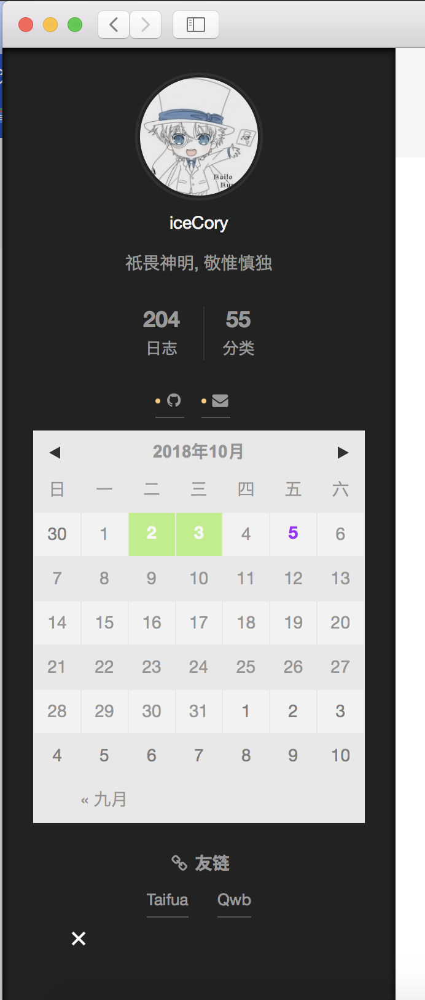

# theme-next-calendar

简洁的hexo-next日历云插件, 在日历上显示提交标记



### 安装

1. 首先安装hexo插件

```shell
npm install --save git://github.com/icecory/theme-next-calendar#hexo
git clone --depth=1 git@github.com/icecory/theme-next-calendar themes/next/source/lib/calendar
```

2. 配置
把sidebar.swig, calendar.styl放到${root}/source/_data目录下

在`themes/next/layout/_layout.swig`最后加入``

4. 在next主题配置文件`_config.yml`配置
```ymal
custom_file_path:
  sidebar: source/_data/sidebar.swig
  styles: source/_data/calendar.styl

CloudCalendar:
  enable: true
  language: zh-CN
  single: true
  root: /calendar/
```

### 渲染日历

默认是在边栏中渲染, 当然也可以在任何位置显示, 只要移动`sidebar.swig`中的代码即可

### 自定义日历颜色

日历插件内各元素的颜色都是可定制的, 可以通过修改`calendar.styl`文件来达到更好的效果.

### 说明

提取自`Landscape-F`主题, 修改后适配theme-next
